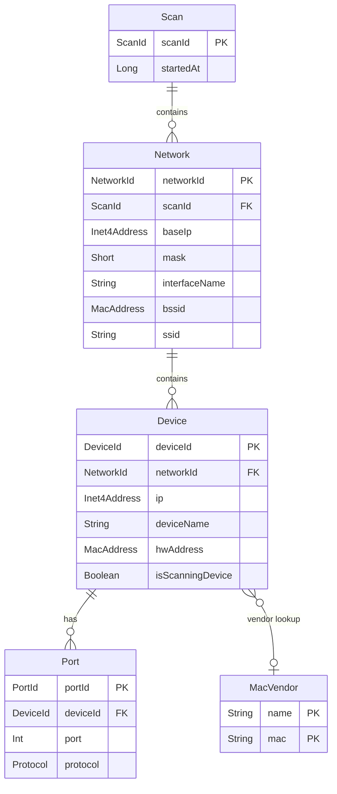

# Contributing

## Data Model

```mermaid
erDiagram
    Scan ||--o{ Network : contains
    Network ||--o{ Device : contains
    Device ||--o{ Port : has
    Device }o--o| MacVendor : "vendor lookup"

    Scan {
        ScanId scanId PK
        Long startedAt
    }
    Network {
        NetworkId networkId PK
        ScanId scanId FK
        Inet4Address baseIp
        Short mask
        String interfaceName
        MacAddress bssid
        String ssid
    }
    Device {
        DeviceId deviceId PK
        NetworkId networkId FK
        Inet4Address ip
        String deviceName
        MacAddress hwAddress
        Boolean isScanningDevice
    }
    Port {
        PortId portId PK
        DeviceId deviceId FK
        Int port
        Protocol protocol
    }
    MacVendor {
        String name PK
        String mac PK
    }
```
