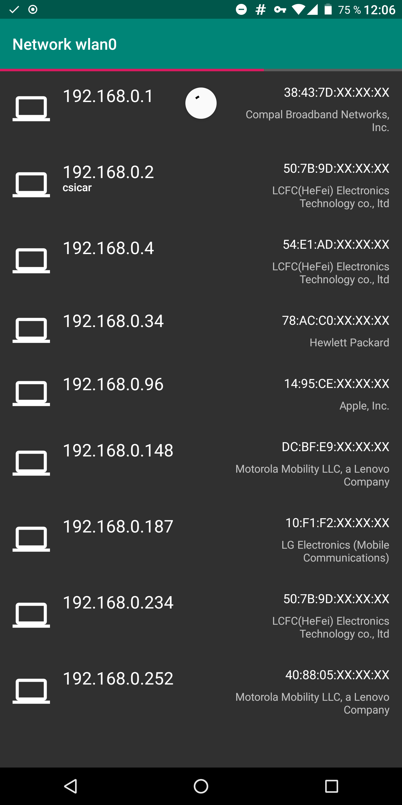

Scan local network for active devices.

[](https://f-droid.org/packages/de.csicar.ning/)

Features
--------
* Ping scan
* ARP scan
* TCP and UDP scan
* Network Service Discovery (Bonjour, Avahi)
* Vendor detection




Build Vendor DB
---------------

```bash
go run createMacVendorDB.go
```
