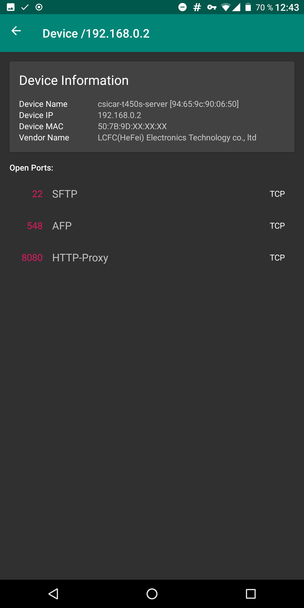
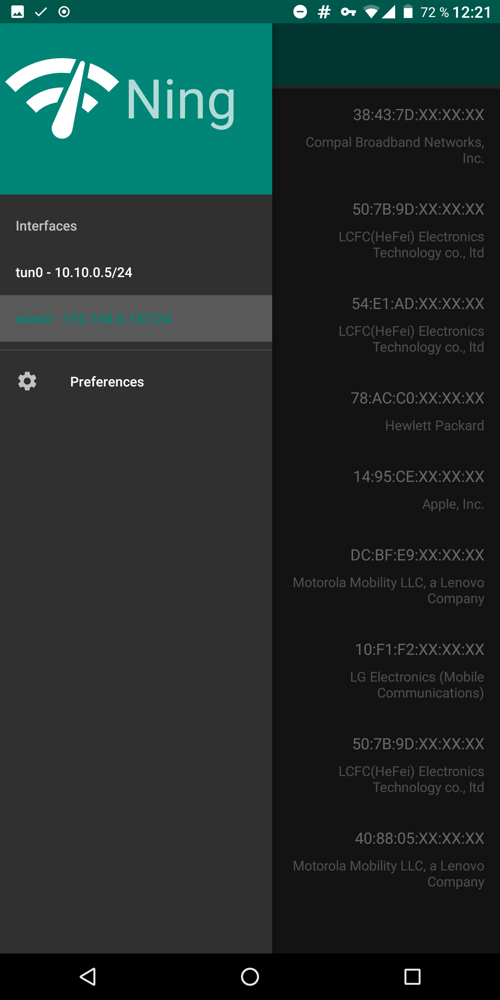

Scan local network for active devices.

[](https://f-droid.org/packages/de.csicar.ning/)


Features
--------
* Ping scan
* ARP scan
* TCP and UDP scan
* Network Service Discovery (Bonjour, Avahi)
* Vendor detection






Roadmap
-------

- [ ] Scan History
    - [x] Save past scans in local db
    - [x] Use past scans for candidate selection on next scan
    - [ ] UI for scan history
- [ ] producer consumer architecture for scan
    - run `n` pings in parallel, start new ping when one ping is finished
- [ ] combine scanners into `UnifiedDeviceScanner`
- [ ] Low-Level mDNS Service Discovery


Contributing
------------

### Translate the App

If you want to translate the app in your language: great!

Translatable text is located in two places:

- All strings used in the app are located under https://github.com/csicar/Ning/tree/master/app/src/main/res

- The app description for F-Droid etc. are located under https://github.com/csicar/Ning/tree/master/fastlane/metadata/android

### Development in Android Studio

The project should be easy to import in Android Studio: Just clone the repository and import it.

### Build Vendor DB
```bash
go run createMacVendorDB.go
```